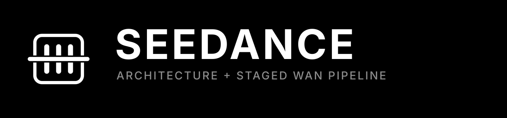
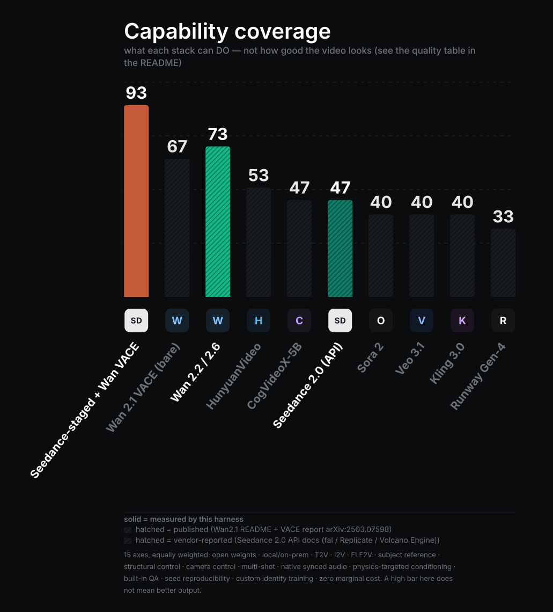
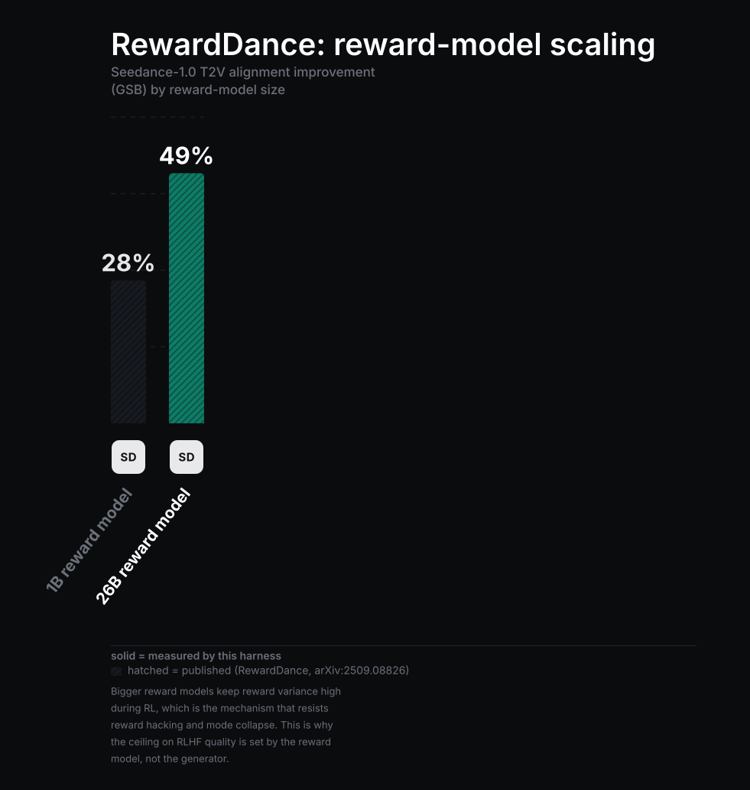
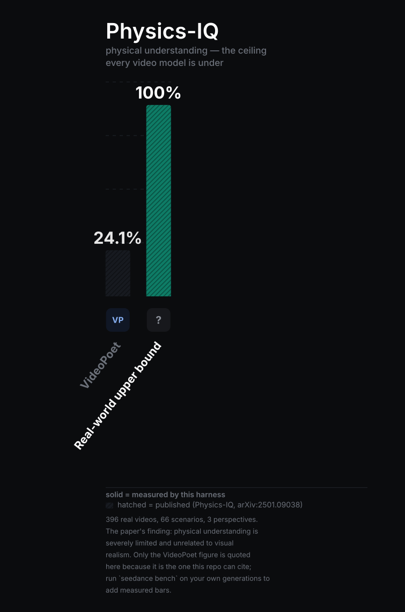

<p align="center">
  
</p>

<p align="center">
  <b>A Seedance-architecture implementation, and a four-stage pipeline that runs it over any Wan checkpoint on Hugging Face.</b>
</p>

<p align="center">
  <a href="#benchmarks">Benchmarks</a> ·
  <a href="#quick-start">Quick start</a> ·
  <a href="#requirements">Requirements</a> ·
  <a href="#usage">Usage</a> ·
  <a href="#how-it-works">How it works</a> ·
  <a href="#what-makes-it-seedance">What makes it Seedance</a> ·
  <a href="#architecture-tutorial">Architecture tutorial</a>
</p>

---

## Benchmarks

<p align="center">
  
</p>

Read that chart carefully, because it is easy to misread. It measures **what
each stack can do**, not how good the video looks. Solid bars are measured by
this repo's harness; hatched bars are published or vendor-reported, with the
citation in the legend. That distinction is enforced in code — an entry with a
non-measured number and no citation raises at load time.

### Where this stack actually stands

| Axis | Leader | This stack | Honest gap |
|---|---|---|---|
| **Raw output quality** (T2V) | Seedance 2.0, then Sora 2 / Veo 3.1 / Kling 3.0 | Wan-class | Large. Vendor evals put Seedance 2.0 first (Arena Elo 1450 ±15 T2V, 1449 ±11 I2V — *their* numbers, preliminary at access time). |
| **Motion stability** | Seedance 2.0 | Wan 2.1/2.2 + Stage 4 | Meaningful. Stage 4 fixes flicker and drift, not motion coherence. |
| **Native synced audio** | Seedance 1.5/2.0 (dual-branch, binaural multi-track) | ✗ | Not reproducible. Wan 2.1 has no audio branch; we mix authored tracks. |
| **Multi-shot narrative** | Seedance 2.0 (native, one sequence) | chained shots, colour-matched seams | Real but smaller gap. |
| **Physical plausibility** | nobody | proxy-conditioned | Physics-IQ: "severely limited, and unrelated to visual realism" for *every* model tested; VideoPoet scored 24.1%. |
| **Capability coverage** | **this stack (93)** | — | Open weights, local, structural + camera + physics control, LoRA identities, built-in QA, zero marginal cost. |
| **Control fidelity** | **this stack** | — | Depth/pose/flow/trajectory/physics guides through VACE; no API exposes this. |
| **Reproducibility** | **this stack** | — | Same seed + weights + config = same frames. Closed APIs re-roll silently. |
| **Cost per clip** | **this stack** | — | Zero after hardware. |

So: if you want the best-looking eight seconds, use the Seedance 2.0 API. If you
want control, privacy, custom identities, reproducibility and no per-clip bill,
this is the stack — and the chart above is what that trade looks like.

### Per-benchmark detail

| Benchmark | What it measures | Who leads | Our position | Run it |
|---|---|---|---|---|
| **Capability coverage** | 15 feature axes | **this stack, 93** | 1st | `seedance chart --results capability_coverage` |
| **Stage ablation** | does each stage earn its runtime, on your GPU | measured locally | — | `seedance ablate --model <repo>` |
| **Temporal QA** | smoothness, flicker, colour drift, structural persistence | measured locally | — | `seedance bench out.mp4` |
| **Physics-IQ** | physical understanding vs a real continuation | nobody (24.1% for VideoPoet) | proxy conditioning helps, does not solve | `seedance.bench.physics_iq` |
| **RewardDance scaling** | RM size → alignment gain | 26B RM: +49.0% vs 1B: +28.0% | implemented; no weights shipped | `seedance chart --results reward_scaling` |
| **DanceGRPO** | RL gain on rectified flows | +56% visual / +181% motion (HunyuanVideo) | implemented | `seedance.reward.dance_grpo` |

<p align="center">
  
  
</p>

### Make your own chart

Every chart here is generated from a JSON file, in the same style:

```bash
seedance chart --all                      # re-render the shipped ones

cat > mine.json <<'JSON'
{
  "title": "Coding",
  "subtitle": "pass@1 on our internal suite",
  "y_max": 100,
  "entries": [
    {"name": "Ours",     "value": 77, "logo": "seedance", "source": "measured", "highlight": true},
    {"name": "Baseline", "value": 59, "logo": "wan", "source": "published",
     "citation": "arXiv:2503.20314"}
  ]
}
JSON
seedance chart --results mine.json --out mine.svg --png
```

Vendor logos are not shipped — they are trademarks. Drop `sora.svg`, `veo.svg`,
… into `seedance/bench/logos/` and they replace the built-in monograms
automatically; see [`bench/logos/README.md`](bench/logos/README.md).

---

## Quick start

```bash
git clone https://github.com/Wan-Video/Wan2.1 && cd Wan2.1
pip install -r requirements.txt              # Wan
pip install -r seedance/requirements.txt     # this package

python -m seedance.cli doctor                # what this machine can run
python -m seedance.cli generate \
  --model Wan-AI/Wan2.1-T2V-1.3B \
  --prompt "a red fox trotting through fresh snow at dawn" \
  --preset balanced --output fox.mp4
```

`doctor` reports your GPU, which dependencies are missing, which optional
stages will silently fall back, and which checkpoint to start with. Run it
first; it saves an hour.

No GPU? `--model mock` exercises the entire pipeline with a synthetic generator
and no downloads.

---

## Requirements

### Hardware

| GPU VRAM | Checkpoint | Resolution | ~time / 5 s clip |
|---|---|---|---|
| 8–12 GB | `Wan2.1-T2V-1.3B` | 480p | 4–8 min |
| 12–24 GB | `Wan2.2-TI2V-5B` | 720p | 5–10 min |
| 24–48 GB | `Wan2.1-T2V-14B` (fp8) | 480p | 3–5 min |
| 48–80 GB | `Wan2.1-T2V-14B` / `Wan2.2-A14B` | 720p | 8–15 min |
| none | `--model mock` | — | seconds (synthetic, no weights) |

Order-of-magnitude figures; they swing with steps, precision and offload.
`seedance.runtime.memory.plan_vram()` estimates before you commit and applies
fixes cheapest-first: text encoder → CPU, VAE tiling, model offload, fp8, 480p,
fewer frames, sequential offload.

### Software

| | Package | Why |
|---|---|---|
| **required** | Python ≥ 3.10, `torch ≥ 2.4`, `huggingface_hub`, `transformers ≥ 4.49`, `imageio`, `imageio-ffmpeg`, `pillow`, `numpy < 2` | download, load, sample, write video |
| **recommended** | `diffusers ≥ 0.31`, `accelerate` | Wan 2.2+ (diffusers-format) checkpoints |
| | `opencv-python`, `torchvision` | flow interpolation, RAFT |
| | `ffmpeg` | audio muxing, clip concatenation |
| **optional** | `pybullet` / `mujoco` | Stage 3 physics (else: built-in analytic integrator) |
| | `insightface` + `onnxruntime` | face crop + ArcFace identity drift (else: crop-correlation proxy) |
| | `controlnet_aux` | DWPose/OpenPose guides (**no fallback** — a fabricated skeleton is worse than none) |
| | `gfpgan` | face restoration |
| | `flash_attn` | faster attention (else: PyTorch SDPA) |
| | `cairosvg` | PNG export for charts (SVG always works) |
| | `gradio` | the web UI |

None of it is needed for `seedance models`, `arch`, `chart` or `inspect` —
those run on a bare interpreter.

---

## Usage

### CLI

```bash
seedance doctor                                   # environment + GPU report
seedance models                                   # known Wan checkpoints
seedance inspect <repo-or-path>                   # what is this checkpoint?
seedance arch --variant seedance-2.0              # architecture summary
seedance generate --model <repo> --prompt "..."   # generate
seedance bench out.mp4                            # QA metrics on a clip
seedance chart --results capability_coverage      # render a chart
seedance ablate --model <repo>                    # measure what the stages add
```

Full `generate`:

```bash
seedance generate \
  --model Wan-AI/Wan2.1-VACE-1.3B \
  --prompt "a marble rolls off a table and bounces on tile" \
  --preset cinematic \
  --size 832*480 --frames 81 --steps 40 --seed 42 \
  --subject "a green glass marble with a white swirl" \
  --physics bouncing_ball --physics-engine auto \
  --depth --camera dolly \
  --interpolate 2 --upscale 2 \
  --storyboard shots.txt \
  --output out.mp4 --report run.json
```

* `--preset` — `fast` | `balanced` | `quality` | `cinematic`
* `--subject` — locked into every shot's caption; the cheapest identity trick there is
* `--storyboard` — one shot caption per line; shots are chained and seam-matched
* `--dry-run` — resolve the whole plan and print it without sampling
* `--offline-prompt` — rewrite prompts with templates, never download an LLM

### Python

```python
from seedance import SeedancePipeline
from seedance.pipelines.staged import StageSettings
from seedance.stages.identity import IdentityConfig
from seedance.stages.motion import CameraTrajectory
from seedance.stages.physics import PhysicsScene

settings = StageSettings.preset("quality")
settings.subject_lock = "A woman in a red wool coat, shoulder-length dark hair"
settings.identity = IdentityConfig(reference_images=["hero.png"], method="auto")
settings.camera = CameraTrajectory.orbit(num_frames=81, degrees=45)
settings.physics = PhysicsScene.collision(fps=16)
settings.polish.interpolate = 2

pipe = SeedancePipeline("Wan-AI/Wan2.1-VACE-1.3B", settings=settings)
print(pipe.capability_report())        # what this checkpoint can and cannot do

result = pipe.generate(
    "two billiard balls collide on a slate table",
    size="832*480", num_frames=81, seed=42, output="collide.mp4",
)
print(result.summary())
print(result.report["polish"]["qa"])   # temporal QA on the finished clip
```

### Image-to-video, first-last-frame, multi-shot

```python
# I2V — the task is inferred from the inputs and the checkpoint
pipe.generate("she turns to face the camera", image="frame0.png", output="i2v.mp4")

# FLF2V — both boundaries pinned
pipe.generate("the door swings open", image="closed.png", last_image="open.png",
              output="flf2v.mp4")

# multi-shot: shots generated in order, chained through I2V/FLF2V, seams colour-matched
from seedance.story import Shot, Storyboard

board = Storyboard("a morning routine")
board.add(Shot("she pours coffee, close on the cup", 33))
board.add(Shot("she walks to the window, medium shot", 33))
board.add(Shot("she looks out at the rain, over the shoulder", 33))
pipe.generate("a morning routine", storyboard=board, output="shots.mp4")
```

### Web UI / Hugging Face Space

```bash
python -m seedance.app_gradio --model Wan-AI/Wan2.1-T2V-1.3B
```

The same file works as a Space entry point: set `SEEDANCE_MODEL`, use a GPU
tier (L4/A10G for 1.3B). Weights load lazily on the first generate, so the
Space boots instantly instead of downloading at startup.

---

## How it works

```
prompt ──► Stage 1  dense-caption rewrite (Qwen or templates), storyboard split
              │
              ▼
        Stage 2  identity: VACE/Phantom refs · LoRA · locked subject clause
                 motion:   depth · pose · flow · camera (Plücker) · trajectory
              │
              ▼
        Stage 3  physics proxy: simulate → render → guide video  (PhysGen pattern)
              │
              ├──── guides blended into ONE control video ────┐
              ▼                                               ▼
        ┌──────────────── backend ─────────────────┐   (VACE control path)
        │ any Wan checkpoint, auto-detected:       │
        │ native loader | diffusers | MoE | mock   │
        └──────────────────────────────────────────┘
              │
              ▼
        Stage 4  colour stabilise → interpolate → face restore → upscale → QA
              │
              ▼
           mp4 + JSON report (timings, stages, QA, warnings)
```

**Stage-4 order is not arbitrary.** Interpolating before fixing colour drift
propagates the drift into the new frames; upscaling before restoring faces
amplifies artifacts the restorer then fights; QA runs last, on the actual
deliverable.

**The backend is detected from files, not names.** `model_index.json` or a
`transformer/` folder → diffusers. `Wan2.x_VAE.pth` + `models_t5_umt5-*.pth` →
native loader. A CLIP `.pth`, or `in_dim ≥ 32` in `config.json` → I2V.
`high_noise_model/` + `low_noise_model/` → Wan 2.2 MoE. `*.gguf` → flagged with
a pointer to ComfyUI-GGUF. That is why community fine-tunes and mirrors load.

**Unusable controls are reported, never dropped silently.** Ask for a depth
guide on a plain T2V checkpoint and the warning lands in the result object and
the JSON report — the failure mode worth avoiding is a control signal quietly
ignored for a whole render.

---

## What makes it Seedance

`seedance/models` implements what ByteDance actually published. Every row is
tagged with its source; the claim-by-claim table is in
[`docs/PROVENANCE.md`](docs/PROVENANCE.md).

| Seedance mechanism | Source | Implemented in |
|---|---|---|
| Decoupled spatial / temporal layers | `[1.0]` | `models/dit.py` |
| MMDiT joint attention **only** in spatial layers, per-modality weights | `[1.0]` | `models/dit.py`, `models/attention.py` |
| Window partitioning inside temporal layers | `[1.0]` | `models/attention.py` |
| Q/K normalisation before attention | `[1.0]` | `models/attention.py` |
| Multishot MM-RoPE (3D visual + 1D text, per-shot offsets) | `[1.0]` | `models/rope.py` |
| Unified task formulation (channel-concat + binary mask) | `[1.0]` | `models/conditioning.py` |
| Temporally-causal 3D VAE, (4,16,16), C=48 | `[1.0]` | `models/vae3d.py` |
| No DiT-side patchify (DC-AE) | `[1.0]` | `config.py` (`patch_size=(1,1,1)`) |
| PatchGAN hybrid discriminator (appearance + motion) | `[1.0]` | `models/vae3d.py` |
| Thin VAE decoder (~2× faster decode) | `[1.0]` | `models/vae3d.py` |
| Decoder-only LLM as text encoder | `[1.0]` | `models/text_encoder.py` |
| Qwen2.5-14B prompt-engineering stage (SFT → DPO) | `[1.0]` | `stages/prompt_enhancer.py` |
| Cascaded 480p → 720p/1080p refiner | `[1.0]` | `models/refiner.py` |
| TSCD + score + adversarial distillation | `[1.0]` | `flow/distill.py` |
| RewardDance (yes-token reward, RM scaling) | `arXiv:2509.08826` | `reward/reward_dance.py` |
| DanceGRPO (GRPO over the denoising MDP) | `arXiv:2505.07818` | `reward/dance_grpo.py` |
| Dual-branch DiT + cross-modal joint module | `[1.5/2.0]` | `models/audio.py` |
| Rectified-flow / MMDiT backbone | `[1.5/2.0]` | `flow/rectified_flow.py` |
| 4–15 s, 480p/720p, 3 video / 9 image / 3 audio references | `[product]` | `config.py`, `story.py` |

**And what is *not* Seedance, stated plainly:** there is no physics engine
anywhere in the Seedance stack — its plausibility is emergent from data
curation and reward modelling. Stage 3 is a different approach (PhysGen-style
proxy conditioning) that helps on collision and gravity shots and is brittle
elsewhere. The widely repeated "DB-DiT with a millisecond-level attention
bridge" description is marketing copy, not paper content, so `models/audio.py`
makes the tokenizer configurable rather than asserting a design.

---

## Architecture tutorial

There are **no public Seedance weights**. The architecture runs, trains and can
be inspected; from scratch it emits noise, which is correct for an untrained
model and is stated in every result object it returns.

### 1. Look at it

```bash
python -m seedance.cli arch --variant seedance-2.0
```

```
VAE stride         : (4, 16, 16)  latent channels: 48
DiT dim/heads      : 3584/28
spatial layers     : 28 (MMDiT, intra-frame, text+visual)
temporal layers    : 28 (visual only, window (8, 8))
patch size         : (1, 1, 1) (DC-AE: no DiT-side patchify)
audio branch       : on, tracks ('music', 'ambience', 'voice')
flow               : rectified, shift 5.0, 50 steps, solver unipc
latent for 97f 480x832: C=48 T=25 H=30 W=52
```

### 2. Run it end to end (CPU, seconds)

```bash
python -m seedance.examples.native_architecture --variant dev-tiny
```

VAE round trip → training step with gradients → multi-shot sampling → decode.

### 3. Build the pieces yourself

```python
import torch
from seedance.config import get_config
from seedance.models.vae3d import TemporallyCausalVAE
from seedance.models.dit import SeedanceDiT
from seedance.models.conditioning import build_condition

cfg = get_config("seedance-1.0")           # real geometry: (4,16,16), C=48

vae = TemporallyCausalVAE(cfg.vae).eval()
video   = torch.randn(1, 3, 9, 64, 64)     # frames must be 1 + 4k
latents = vae.encode(video, sample=False)  # -> [1, 48, 3, 4, 4]
frames  = vae.decode(latents)              # -> [1, 3, 9, 64, 64]

# long clips stream through a rolling causal cache, bit-identical to one pass
chunked = vae.decode(latents, chunk_frames=1)
assert (frames - chunked).abs().max() < 1e-5

dit  = SeedanceDiT(cfg.dit)
cond = build_condition(tuple(latents.shape), "i2v",
                       clean_latents=latents[:, :, :1])    # pin the first frame
velocity = dit(
    latents, torch.tensor([500.0]),
    text=torch.randn(1, 32, cfg.dit.text_dim),
    condition=cond,
    shot_lengths=[2, 1],                                   # multishot MM-RoPE
)
```

### 4. Train it

```python
from seedance.pipelines.native import SeedanceNativePipeline

pipe = SeedanceNativePipeline(get_config("dev-tiny"), device="cuda")
loss, logs = pipe.training_step(video_batch, ["a dense caption", "another one"])
loss.backward()
```

The rectified-flow convention, used everywhere:

```
x_t      = (1 - t)·x_0 + t·ε
v_target = ε - x_0
sampling: x ← x - dt·v          (integrating down from t = 1)
```

`RectifiedFlow.self_consistency_check()` integrates an analytic field and
asserts it lands on the data point. Sign errors here are silent — they produce
plausible-looking noise — which is exactly why it is a test.

### 5. Distil and RL it

```python
from seedance.flow.distill import TSCDDistiller
from seedance.reward.dance_grpo import DanceGRPO, GRPOConfig
from seedance.reward.reward_dance import build_reward_model

# 8 → 4 → 2 → 1 segments; each stage is a usable few-step sampler on the way down
tscd = TSCDDistiller(student, teacher, segments=8)
loss, logs = tscd.step(clean_latents); loss.backward(); tscd.after_step()

# a real VLM reward if one is available, weightless proxies otherwise
grpo = DanceGRPO(policy, build_reward_model("auto"),
                 cfg=GRPOConfig(group_size=8, num_steps=16), decode_fn=vae.decode)
grpo.train_step((8, 48, 13, 30, 52), optimizer, prompts=prompts * 8)
```

### 6. Verify it

```bash
python -m pytest seedance/tests -q     # 95 tests
```

The architecture tests target what fails silently: temporal causality (perturb
the last frame, assert earlier latents are unchanged), window round-trips with
padding, RoPE norm preservation, text-mask effect, zero-init output, and the
flow parameterisation.

---

## Not reproducible from open weights

`pipe.capability_report()` returns this at runtime, and every report carries it:

1. **Native joint audio-video** — one dual-branch model producing both.
2. **The `@mention` 4-modality reference system** — `story.py` implements the
   surface (budgets, roles, resolution), not the token injection.
3. **Seedance's emergent physics** — approximated with a simulated proxy.
4. **The reported ~90% first-try usability rate.**

The realistic ceiling for the open stack is ~60–70% of Seedance behaviour. That
is an engineering judgment, not a measurement, and it depends on content:
talking heads land near the top of the range, multi-character sports near the
bottom.

---

## Layout

```
seedance/
  config.py            provenance-tagged configs, torch-free
  story.py             storyboards, references, @mention parsing, torch-free
  models/              DiT · VAE · RoPE · attention · audio · text encoder · refiner
  flow/                rectified flow · solvers · distillation
  reward/              RewardDance · DanceGRPO · heuristic proxies
  backends/            registry + detection · Wan native · diffusers · mock
  stages/              prompt · identity · motion · physics · polish · audio · multishot
  pipelines/           staged (runnable) · native (reference)
  runtime/             VRAM planning · acceleration · video/audio I/O
  bench/               chart renderer · logos · ablation · Physics-IQ protocol
  assets/              logo + generated charts
  examples/  tests/    runnable scripts and 95 tests
```

## Using it outside this repo

`wan` is imported lazily and only by the native loader, so the package is
self-contained:

```bash
cp seedance/packaging/pyproject.standalone.toml ./pyproject.toml
pip install .                    # or: pip install '.[diffusers,stages,ui]'
```

Without the `wan` package, the diffusers backend still handles every
diffusers-format Wan checkpoint.

## Credits

Seedance 1.0 (arXiv:2506.09113) · Seedance 1.5 Pro (arXiv:2512.13507) ·
Seedance 2.0 (arXiv:2604.14148) · RewardDance (arXiv:2509.08826) ·
DanceGRPO (arXiv:2505.07818) · Physics-IQ (arXiv:2501.09038) ·
PhysGen (arXiv:2409.18964) · CameraCtrl (arXiv:2404.02101) ·
Tora (arXiv:2407.21705) · SeedVR2 (arXiv:2506.05301) · Wan (arXiv:2503.20314).

This package implements published *methods*. It contains no ByteDance weights,
code or assets, and no vendor logos are redistributed.
